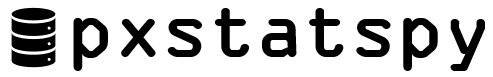

<picture align="center">
  <source media="(prefers-color-scheme: dark)" srcset="images/pxstatspy_dark.png">
  
</picture>

# PxStatsPy

A comprehensive Python wrapper for the Statistics Sweden PxWebAPI 2.0, providing easy access to Swedish statistical data.

[](#)
[](LICENSE)

**Note:** This is an independent project and is not associated with Statistics Sweden (SCB).

## Features

- Complete Python interface for Statistics Sweden's PxWebAPI 2.0
- Comprehensive search functionality for statistical tables
- Flexible data filtering and selection options
- Support for multiple data formats:
  - Pandas DataFrames with customizable options
  - JSON (json-stat2 format)
  - CSV with various delimiter options
- Built-in API rate limit controls 
- Built-in error handling and intelligent response parsing
- Multilanguage support (Swedish/English)

## Requirements

- Python 3.7 or higher
- Dependencies:
  - pandas >= 1.0.0
  - requests >= 2.25.0

## Installation

Install the latest version:

```bash
pip install pxstatspy
```

For development installation:

```bash
git clone https://github.com/xemarap/pxstatspy.git
cd pxstatspy
pip install -e .
```

## Quick Start
Visit the **PxStatsPy - Get started** tutorial notebook for extensive usage guide.

```python
from pxstatspy import PxAPI, PxAPIConfig, OutputFormat, OutputFormatParam

# Initialize client
config = PxAPIConfig(
    base_url="https://statistikdatabasen.scb.se/api/v2",
    language="en"  # or "sv" for Swedish
)

client = PxAPI(config)

# Search for population statistics tables updated last 30 days
client.find_tables(
    query="Population",
    past_days=30,
    display=True
)

# Get data as DataFrame
df = client.get_data_as_dataframe(
    table_id="TAB1267",
    value_codes={
        "Tid": ["2024"],
        "Region": ["00", "01"],
        "ContentsCode": ["BE0101A9"]
    }
)
```

## Contributing

Contributions are welcome! Please feel free to submit a Pull Request. For major changes, please open an issue first to discuss what you would like to change.

1. [Submit suggestions and report bugs (for faster troubleshooting please enable debug mode and submit the errormessage)](https://github.com/xemarap/pxstatspy/issues)
2. [Open a Pull Request](https://github.com/xemarap/pxstatspy)
3. [Star the GitHub page](https://github.com/xemarap/pxstatspy)

## Resources

- [Statistics Sweden PxWebAPI 2.0 Documentation](https://www.scb.se/vara-tjanster/oppna-data/pxwebapi/pxwebapi-2.0)

## License

This project is licensed under the MIT License - see the LICENSE file for details.

This project uses the following open source resources:
- [PxWebAPI 2.0 (beta)](https://github.com/PxTools/PxApiSpecs/tree/master)
- [requests](https://github.com/psf/requests)
- [pandas](https://github.com/pandas-dev/pandas)

The full license texts are available in the LICENSES directory.

## Acknowledgments

- Statistics Sweden for providing the PxWebAPI 2.0
- Contributors to the project